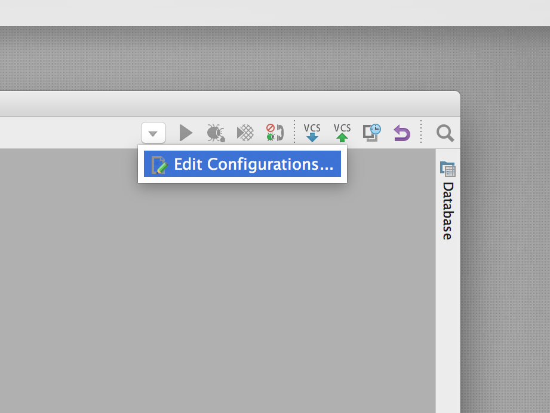
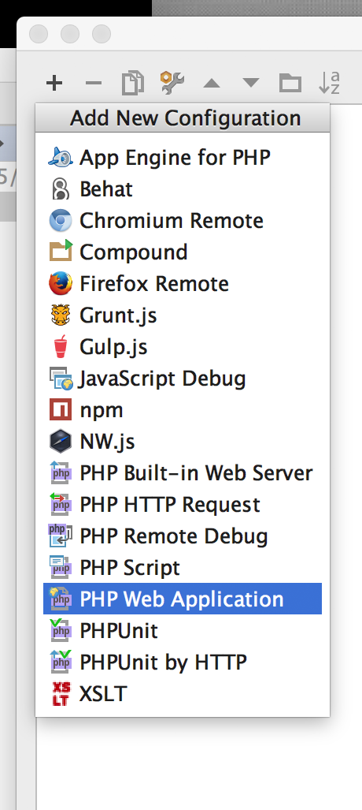
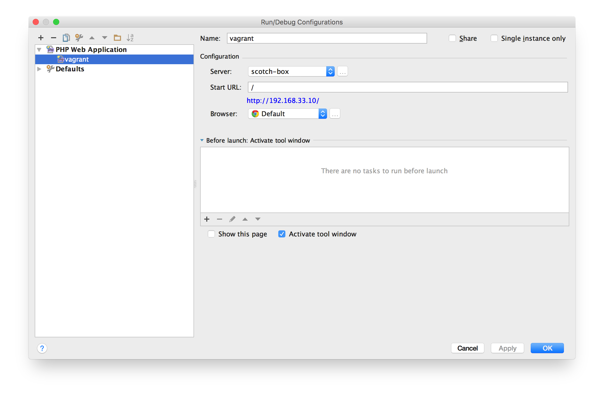
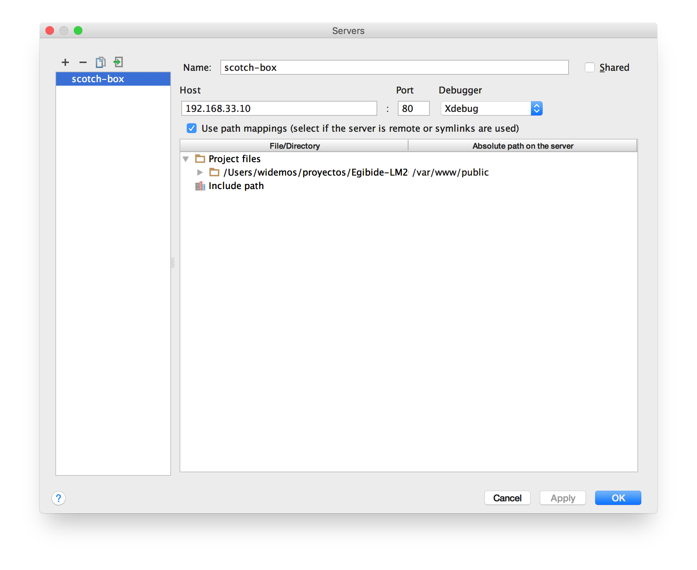

# Egibide - Scotch Box

Esta es una versión personalizada de la máquina original que se puede encontrar en [box.scotch.io][16].

## Inicio rápido

* Descargar e instalar [Vagrant][3].
* Descargar e instalar [VirtualBox][4] y sus extensiones cuando lo pida.
* Clonar [este repositorio](https://github.com/Egibide-LM2015/scotch-box) en una carpeta del ordenador.
* Ejecutar el comando ``` vagrant up ``` en esa carpeta.
* Acceder al proyecto a través de la dirección [http://192.168.33.10/][14]

## Acceso a MySQL

Para poder acceder desde el equipo anfitrión al servidor de base de datos MySQL con el usuario `root`, necesitamos ejecutar en la línea de comandos:

```bash
mysql -e "GRANT ALL PRIVILEGES ON *.* TO 'root'@'%' IDENTIFIED BY 'root';"

sudo service mysql restart
```

## Comandos básicos de Vagrant

### Arrancar el servidor
```bash
vagrant up
```

### Pausar el servidor
```bash
vagrant suspend
```

### Apagar el servidor
```bash
vagrant halt
```

### Borrar el servidor
```bash
vagrant destroy
```

### Acceder por SSH al servidor
```bash
vagrant ssh
```
En Windows hay que tener un cliente SSH para que este comando funcione. Se puede instalar el cliente de [Git](https://git-scm.com/downloads) y utilizar el shell que proporciona, que incluye SSH.

## Usuarios y contraseñas

### MySQL 

- Hostname: localhost or 127.0.0.1
- Username: root
- Password: root
- Database: scotchbox

### PostgreSQL

- Hostname: localhost or 127.0.0.1
- Username: root
- Password: root
- Database: scotchbox
- Port: 5432

### MongoDB

- Hostname: localhost
- Database: scotchbox
- Port: 27017

### SSH Access

- Hostname: 127.0.0.1:2222
- Username: vagrant
- Password: vagrant

## Habilitar la depuración con PhpStorm

### Crear una nueva configuración


### Generar una aplicación web PHP


### Configuración de la aplicación


### Configuración del servidor


## The MIT License (MIT)

Copyright (c) 2014-2015 Nicholas Cerminara, scotch.io, LLC

Permission is hereby granted, free of charge, to any person obtaining a copy of this software and associated documentation files (the "Software"), to deal in the Software without restriction, including without limitation the rights to use, copy, modify, merge, publish, distribute, sublicense, and/or sell copies of the Software, and to permit persons to whom the Software is furnished to do so, subject to the following conditions:

The above copyright notice and this permission notice shall be included in all copies or substantial portions of the Software.

THE SOFTWARE IS PROVIDED "AS IS", WITHOUT WARRANTY OF ANY KIND, EXPRESS OR IMPLIED, INCLUDING BUT NOT LIMITED TO THE WARRANTIES OF MERCHANTABILITY, FITNESS FOR A PARTICULAR PURPOSE AND NONINFRINGEMENT. IN NO EVENT SHALL THE AUTHORS OR COPYRIGHT HOLDERS BE LIABLE FOR ANY CLAIM, DAMAGES OR OTHER LIABILITY, WHETHER IN AN ACTION OF CONTRACT, TORT OR OTHERWISE, ARISING FROM, OUT OF OR IN CONNECTION WITH THE SOFTWARE OR THE USE OR OTHER DEALINGS IN THE SOFTWARE.


 [1]: https://github.com/MiniCodeMonkey/Vagrant-LAMP-Stack
 [2]: http://scotch.io/tutorials/get-vagrant-up-and-running-in-no-time
 [3]: https://www.vagrantup.com/downloads.html
 [4]: https://www.virtualbox.org/wiki/Downloads
 [5]: http://www.sequelpro.com/
 [6]: http://www.navicat.com/
 [7]: http://github.com/scotch-io
 [8]: http://twitter.com/scotch_io
 [9]: https://github.com/smdahlen/vagrant-hostmanager
 [10]: http://scotch.io/tutorials/sharing-your-virtual-machine-on-the-web-with-vagrant-share
 [11]: http://scotch.io/tutorials/php/getting-started-with-laravel-homestead
 [12]: https://www.vagrantup.com/downloads.html
 [13]: https://www.virtualbox.org/wiki/Downloads
 [14]: http://192.168.33.10/
 [15]: https://github.com/smdahlen/vagrant-hostmanager
 [16]: http://box.scotch.io
 [17]: http://scotch.io/bar-talk/introducing-scotch-box-a-vagrant-lamp-stack-that-just-works
